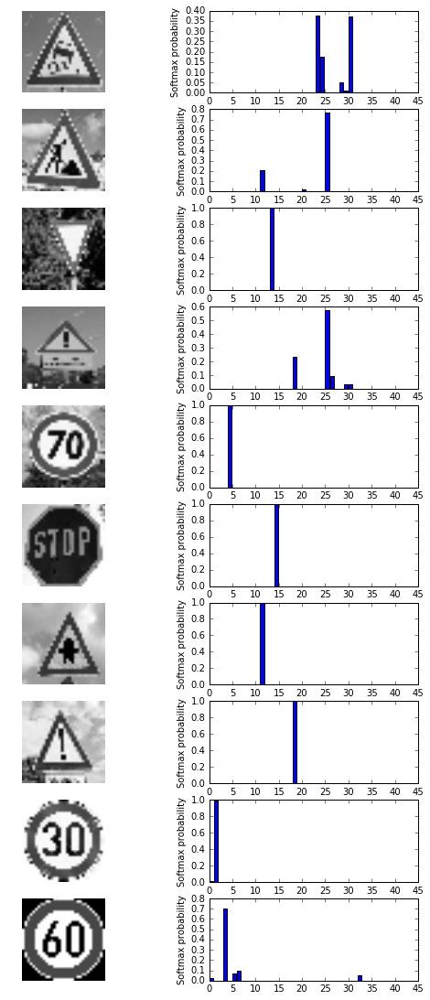

# Self-Driving Car Engineer Nanodegree

## Deep Learning Project: Build a Traffic Sign Recognition Classifier

---
### Data Set Summary & Exploration

#### 1. Provide a basic summary of the data set. In the code, the analysis should be done using python, numpy and/or pandas methods rather than hardcoding results manually.

I used basic Python and NumPy syntax to create a summary of the dataset. None of these values are hardcoded.

```
n_train = len(X_train)
n_validation = len(X_valid)
n_test = len(X_test)
image_shape = X_train[0].shape
n_classes = len(set(y_train))

print("Number of training examples =", n_train)
print("Number of validation examples =", n_validation)
print("Number of testing examples =", n_test)
print("Image data shape =", image_shape)
print("Number of classes =", n_classes)
```

    Number of training examples = 34799
    Number of validation examples = 4410
    Number of testing examples = 12630
    Image data shape = (32, 32, 3)
    Number of classes = 43

Validation examples are about ~13% of the size of the training data. These are the samples which are used during the training process to benchmark our training.

Testing examples are about 36% of the size of the training data. These are samples which are only used to evaluate mode performance only AFTER model tuning and training are completely done. If they are used before that, we run the risk of biasing our model towards this data.

The one that needs a bit of explanation is the "Image data shape." The result, (32,32,3) means that our images are NumPy arrays representing three channel images which are 32x32 pixels. 

Classes is the number of unique traffic signs our model is expected to be able to identify. All I had to do was to count unique occurances of each training label.

#### 2. Include an exploratory visualization of the dataset.

Let's first get an idea of what kind of data we're working with. Let's plot some signs out at random just to see how they look.


Now, let's plot historgrams of all of our data. Imbalanced data typically refers to a problem with classification problems where the classes are not represented equally. We want to have balanced data as much as possible. Let's see how balanced it is.


Training set histogram


    Number of bins: 44 
    
    Bin boundaries:  [  0.           0.97674419   1.95348837   2.93023256   3.90697674
       4.88372093   5.86046512   6.8372093    7.81395349   8.79069767
       9.76744186  10.74418605  11.72093023  12.69767442  13.6744186
      14.65116279  15.62790698  16.60465116  17.58139535  18.55813953
      19.53488372  20.51162791  21.48837209  22.46511628  23.44186047
      24.41860465  25.39534884  26.37209302  27.34883721  28.3255814
      29.30232558  30.27906977  31.25581395  32.23255814  33.20930233
      34.18604651  35.1627907   36.13953488  37.11627907  38.09302326
      39.06976744  40.04651163  41.02325581  42.        ] 
    
    Histogram counts: [ 180 1980 2010 1260 1770 1650  360 1290 1260 1320 1800 1170 1890 1920  690
      540  360  990 1080  180  300  270  330  450  240 1350  540  210  480  240
      390  690  210  599  360 1080  330  180 1860  270  300  210  210] 
    

Validation set histogram


    Number of bins: 44 
    
    Bin boundaries:  [  0.           0.97674419   1.95348837   2.93023256   3.90697674
       4.88372093   5.86046512   6.8372093    7.81395349   8.79069767
       9.76744186  10.74418605  11.72093023  12.69767442  13.6744186
      14.65116279  15.62790698  16.60465116  17.58139535  18.55813953
      19.53488372  20.51162791  21.48837209  22.46511628  23.44186047
      24.41860465  25.39534884  26.37209302  27.34883721  28.3255814
      29.30232558  30.27906977  31.25581395  32.23255814  33.20930233
      34.18604651  35.1627907   36.13953488  37.11627907  38.09302326
      39.06976744  40.04651163  41.02325581  42.        ] 
    
    Histogram counts: [ 30 240 240 150 210 210  60 150 150 150 210 150 210 240  90  90  60 120
     120  30  60  60  60  60  30 150  60  30  60  30  60  90  30  90  60 120
      60  30 210  30  60  30  30] 
    
Test set histogram


    Number of bins: 44 
    
    Bin boundaries:  [  0.           0.97674419   1.95348837   2.93023256   3.90697674
       4.88372093   5.86046512   6.8372093    7.81395349   8.79069767
       9.76744186  10.74418605  11.72093023  12.69767442  13.6744186
      14.65116279  15.62790698  16.60465116  17.58139535  18.55813953
      19.53488372  20.51162791  21.48837209  22.46511628  23.44186047
      24.41860465  25.39534884  26.37209302  27.34883721  28.3255814
      29.30232558  30.27906977  31.25581395  32.23255814  33.20930233
      34.18604651  35.1627907   36.13953488  37.11627907  38.09302326
      39.06976744  40.04651163  41.02325581  42.        ] 
    
    Histogram counts: [ 60 720 750 450 660 630 150 450 450 480 660 420 690 720 270 210 150 360
     390  60  90  90 120 150  90 480 180  60 150  90 150 270  60 210 120 390
     120  60 690  90  90  60  90]


As can be clearly seen above, Udacity made sure that the training, validation, and test data sets are roughly equally distributed across classes. Therefore, I won't attempt to rebalance the data.

----

### Design and Test a Model Architecture

#### 1. Describe how you preprocessed the image data. What techniques were chosen and why did you choose these techniques? Consider including images showing the output of each preprocessing technique. Pre-processing refers to techniques such as converting to grayscale, normalization, etc. (OPTIONAL: As described in the "Stand Out Suggestions" part of the rubric, if you generated additional data for training, describe why you decided to generate additional data, how you generated the data, and provide example images of the additional data. Then describe the characteristics of the augmented training set like number of images in the set, number of images for each class, etc.)

The first step is to preprocess the data. Preprocessing is key. Machine learning algorithm follow the garbage in garbage out principle. Your algorithm depends heavily on the type of training data you use.

##### Pre-process the Data Set (normalization, grayscale, etc.)

Gray scaling is important because it allows us to reduce our input size and thus our model complexity and training time and memory requirements. We are able to get away with gray scaling in the case of traffic sign classification because color is not a relevant feature for traffic signs. The size, shape, text, and so on are what tell us a stop sign is a stop sign. It is true that stop signs are **always** red and therefor it may seem that color is important to keep. But they are **never** blue green, yellow, and thus we don't _need_ to keep the color channels to properly classify road signs.

Minimally, the image data should be normalized so that the data has mean zero and equal variance. For image data, `(pixel - 128)/ 128` is a quick way to approximately normalize the data and can be used in this project. Data normalization is required so that gradient descent will converge faster/properly during training. However, I have read that it is only really needed in the case when your features are on totally different scales of value. See https://www.coursera.org/learn/deep-neural-network/lecture/lXv6U/normalizing-inputs for explanation.

The following code shows that I created functions to perform gray scaling and normalization.

```
### Preprocess the data here. It is required to normalize the data. Other preprocessing steps could include 
### converting to grayscale, etc.
### Feel free to use as many code cells as needed.


from sklearn.utils import shuffle

def gray_normal(input_img):
    output_img = cv2.cvtColor(input_img, cv2.COLOR_BGR2GRAY) 
    #output_img = cv2.equalizeHist(output_img)
    #cv2.normalize(output_img, output_img, 0, 255, cv2.NORM_MINMAX)
    #output_img = (output_img - 128)/ 128
    output_img = (output_img/128)-1
    #output_img = output_img.reshape(32,32,1)
    return output_img

def perform_gray_normal(X,y):
    return_X, return_y = [], []
    for i in range(0,len(X)):
        # Create gray scaled normalized image
        img = gray_normal(X[i])
        # Add gray scaled normalized image
        return_X.append(img.reshape(32,32,1))
        return_y.append(y[i])
    return_X, return_y = shuffle(return_X, return_y)
    return_X = np.array(return_X)
    return_y = np.array(return_y)
    return return_X, return_y
```

Now let's take the Udacity dataset and use it as a baseline to create an augmented dataset. Data augmentation is a technique which allows us to artifically increase our dataset size by performing transformations on our original training data and adding them to the dataset. The transformations allow us to add diversity in conditions (lighging, positional, etc. into our training data. This makes our network more robust against fluctuations.

I will include some code snippets below to show how I augmented the data.

For each training image, I added the following to augment the data:
1. Gaussian blurred image. Imagine a car is driving down the road with a blurry camera lense. adding some random blurring could help simulate this.
2. Noisy image. I added black/white speck of noise in random amounts to help simulate rainfall, snow, mist, or specks of dust attached on the camera lense.
3. Randomly brightned image. This simulates camera overexposure.
4. Randomly darkened image. This simulates camera underexposure.
5. Scaled image. This simulates different distance perspective on the traffic sign.
6. Warped image. This simulates looking at the sign from a differnt yaw angle.
7. Translated image. This shifts the image away from the center around the frame.

There was one thing I originally included but removed:
1. Flipped image. Although this makes sense as a data augmentation step in the next project (behavioral cloning), it does not make sense in this context. The car will **never** (at least for the purposes of this lab) encounter a traffic sign that is flipped on its X or Y axis (i.e. upside and/or backwards) so it is best not to include irrelevant data in our training set. This would only harm our efforts.

Here are examples of my preprocessing:


Another set that I generated was one that was 10% of the size of the original. This proved useful for rapid experimentation and benchmarking while tuning hyperparameters and adding/removing layers.

Andrej Karpathy said in one of his lectures that as a sanity check you should feed the network with very few samples from each class labels and in this way your model should over-fit (that is it performs very well in the training phase but not during test/validation phase). If you're not able to get very high accuracy by training with few samples (coming from each class) then that means something is broken (your implementation is not right).

#### 2. Describe what your final model architecture looks like including model type, layers, layer sizes, connectivity, etc.) Consider including a diagram and/or table describing the final model.

I took the default LeNet architecture and made some minor modifications.

Complexity can be increased in two ways - increasing the number of layers or number of filters in existing layers. Some things I'm trying here: adding layers, changing numbers of filters, changing filter sizes, add dropout.

Regarding tweaking numbers of filters and sizes, this requires experimentation. Usually we use odd sizes like 3x3, 5x5, 7x7. Even numbered and bigger sizes are not usually used.

The idea behind Dropout is to train an ensemble of DNNs and average the results of the whole ensemble instead of train a single DNN. The dropped neurons do not contribute to the training phase in both the forward and backward phases of back-propagation: for this reason **every time a single neuron is dropped out it’s like the training phase is done on a new network.**

https://pgaleone.eu/deep-learning/regularization/2017/01/10/anaysis-of-dropout/

Here is a table summarizing my architceture.


| Layer         		|     Description	        					| 
|:---------------------:|:---------------------------------------------:| 
| Input         		| 32x32x1 RGB image   							| 
| Convolution 3x3     	| 1x1 stride, valid padding, outputs 30x30x12 	|
| RELU					|												|
| Max pooling	      	| 2x2 stride,  outputs 15x15x12 				|
| Convolution 3x3     	| 1x1 stride, valid padding, outputs 13x13x32 	|
| RELU					|												|
| Max pooling	      	| 2x2 stride,  outputs 6x6x32    				|
| Convolution 3x3     	| 1x1 stride, valid padding, outputs 4x4x52 	|
| RELU					|												|
| Max pooling	      	| 2x2 stride,  outputs 2x2x52    				|
| Flatten   	      	| Outputs 208                    				|
| Fully Connected      	| Outputs 120                    				|
| RELU					|												|
| Dropout				| Keep probaility = 0.5							|
| Fully Connected      	| Outputs 84                    				|
| RELU					|												|
| Dropout				| Keep probaility = 0.5							|
| Fully Connected      	| Outputs 43                    				|
| RELU					|												|
| Dropout				| Keep probaility = 0.5							|

##### A Note on Hardware...

Just a quick note on a very frustrating point.

Before moving forward with the Tensorflow portion of the lab, it's important to do a hardware check to make sure that the GPU is working. I have a laptop with an NVIDIA GeForce GT 740M GPU. Training time can be painfully slow even using this GPU since it is a small one so I absolutley can't afford to train on CPU. Furthermore, the NVIDIA drivers on my system can be very flakey and stop working from time to time so it is essential to make sure that my hardware is working right before attempting to train. Output should log to the terminal.

Successful hardware detection looks like this on my system:

    I tensorflow/core/common_runtime/gpu/gpu_device.cc:975] Creating TensorFlow device (/gpu:0) -> (device: 0, name: GeForce GT 740M, pci bus id: 0000:01:00.0)
    Device mapping:
    /job:localhost/replica:0/task:0/gpu:0 -> device: 0, name: GeForce GT 740M, pci bus id: 0000:01:00.0
    I tensorflow/core/common_runtime/direct_session.cc:255] Device mapping:
    /job:localhost/replica:0/task:0/gpu:0 -> device: 0, name: GeForce GT 740M, pci bus id: 0000:01:00.0
    
Going into and out of hibernate/sleep seems to make the GPU disappear. If this doesn't show up, restart the laptop and try again. It seems to help. 

#### 3. Describe how you trained your model. The discussion can include the type of optimizer, the batch size, number of epochs and any hyperparameters such as learning rate.

The process of constructins my model graph was as follows. I mostly reused principles from the default LeNet implementation.

I think it makes sense to reproduce the code here.

```python
    x = tf.placeholder(tf.float32, (None, 32, 32, 1))
    y = tf.placeholder(tf.int32, (None))
    one_hot_y_mod = tf.one_hot(y, 43)
    rate_mod = 0.001
    logits_mod = LeNet_mod(x)
    cross_entropy_mod = tf.nn.softmax_cross_entropy_with_logits(labels=one_hot_y_mod, logits=logits_mod)
    loss_operation_mod = tf.reduce_mean(cross_entropy_mod)
    optimizer_mod = tf.train.AdamOptimizer(learning_rate = rate_mod)
    training_operation_mod = optimizer_mod.minimize(loss_operation_mod)
    correct_prediction_mod = tf.equal(tf.argmax(logits_mod, 1), tf.argmax(one_hot_y_mod, 1))
    accuracy_operation_mod = tf.reduce_mean(tf.cast(correct_prediction_mod, tf.float32))
    saver_mod = tf.train.Saver()
```

For batch size, I used 256. The idea is to load as many samples into GPU memory as will speed up the training process. Although I don't understand all the details yet, I came across a paper which states that 256 is usually the ideal batch size in most cases:
https://arxiv.org/pdf/1804.07612.pdf

It is standard convention to start off with a learning rate of 0.001. If the model looks like it doesnt converge, then decrese it. If the model is converging, then increase it to speed up training time.

Regarding epochs, usually the more the better. However, training on my laptop, even with a GPU is painfully slow so I limited it to 30 epochs. It seemed to be fine in most cases although more would have been better.

#### 4. Describe the approach taken for finding a solution and getting the validation set accuracy to be at least 0.93. Include in the discussion the results on the training, validation and test sets and where in the code these were calculated. Your approach may have been an iterative process, in which case, outline the steps you took to get to the final solution and why you chose those steps. Perhaps your solution involved an already well known implementation or architecture. In this case, discuss why you think the architecture is suitable for the current problem.

My approach to this step was to try three different architectures with three different datasets.

The three architectures were:
1. Plain LeNet from the lesson material
2. My own customized LeNet (details to follow)
3. Someone else's customized LeNet (borrowed from https://github.com/jeremy-shannon/CarND-Traffic-Sign-Classifier-Project)

The three datasets I used to train were:
1. My small dataset whihc is 10% of the nominal dataset provided by Udacity - this was used to quicky benchmark differences between architectures and parameters
2. The nominal dataset provided by Udacity
3. My own augmented dataset

I ran all nine of these permutations to see which performed the best. I will summarize the results here.

| Architecture         	|     Dataset    	        					    | Validation Accuracy    |
|:-------------------------:|:---------------------------------------------:| :---------------------:|
| Plain LeNet         		| Small              							|          83%           |
| Plain LeNet      	        | Nominal                                   	|          92%           |
| Plain LeNet 			    | Augmented										|          93%           |
| My LeNet	      	        | Small                          				|          83%           |
| My LeNet	                | Nominal      									|          89% (not converged)          |
| My LeNet		            | Augmented        								|        **96%**         |
| Other person's LeNet		| Small        									|          89%           |
| Other person's LeNet		| Nominal										|          93%           |
| Other person's LeNet		| Augmented										|          94%           |


A few observations:

1. This shows the power of data augmentation to get better training results. The best validation accuracy for the default LeNet using the augmented data is almost 93%-94%. This is better than using the default dataset. This is validation accuracy is actually good enough to pass the lab assignment according to the rubric points!
2. It may have been better to run with more epochs, espcially since it looked like some training sessions may not have convereged because validation accuracy was still increasing and didn't start "bouncing around" yet. However, I have a weak GPU and this was already very time consuming as is.
3. The best results were using my custom network with the augmented dataset so it is what I will use to evaluate the test data set. I need to think about these results some more but it shows that indeed deep learning is as much of an art as it is a science.


Now, let's evaluate accuracy on my modified network using the augmented dataset.

```
with tf.Session() as sess:
    saver_mod.restore(sess, "./lenet_mod_aug-data")
    test_accuracy_mod = evaluate(accuracy_operation_mod, X_test, y_test, 256)
    print("Test Accuracy = {:.3f}".format(test_accuracy_mod))

```

    Test Accuracy = 0.939


Not bad!

---

### Test a Model on New Images

#### 1. Choose five German traffic signs found on the web and provide them in the report. For each image, discuss what quality or qualities might be difficult to classify.

##### Load and Output the Images

To give myself more insight into how my model is working, I downloaded 10 random German traffic signs from the internet to test. The images must go through the same preprocessing steps as my other data. 

The best images should be centered on the traffic sign, have a 1:1 aspect ratio, and have little else in the frame. I intentionally threw some tough images in there just to see how my model would react. As we will see, my model had the highest levels of uncertainty on these tough/tricky images.

Here are my images in preprocessed format. 


#### 2. Discuss the model's predictions on these new traffic signs and compare the results to predicting on the test set. At a minimum, discuss what the predictions were, the accuracy on these new predictions, and compare the accuracy to the accuracy on the test set (OPTIONAL: Discuss the results in more detail as described in the "Stand Out Suggestions" part of the rubric).

##### Predict the Sign Type for Each Image

These are the results I got when I applied my trained model to perform inference on these images.

    Image:  0
    Prediction:  Slippery road (Class # 23 )
    Actual:  Slippery road Class # 23 )
    
    
    Image:  1
    Prediction:  Beware of ice/snow (Class # 30 )
    Actual:  Road work Class # 25 )
    
    
    Image:  2
    Prediction:  Yield (Class # 13 )
    Actual:  Yield Class # 13 )
    
    
    Image:  3
    Prediction:  Turn right ahead (Class # 33 )
    Actual:  General caution Class # 18 )
    
    
    Image:  4
    Prediction:  Speed limit (70km/h) (Class # 4 )
    Actual:  Speed limit (70km/h) Class # 4 )
    
    
    Image:  5
    Prediction:  Speed limit (30km/h) (Class # 1 )
    Actual:  Stop Class # 14 )
    
    
    Image:  6
    Prediction:  Right-of-way at the next intersection (Class # 11 )
    Actual:  Right-of-way at the next intersection Class # 11 )
    
    
    Image:  7
    Prediction:  General caution (Class # 18 )
    Actual:  General caution Class # 18 )
    
    
    Image:  8
    Prediction:  Speed limit (30km/h) (Class # 1 )
    Actual:  Speed limit (30km/h) Class # 1 )
    
    
    Image:  9
    Prediction:  Speed limit (30km/h) (Class # 1 )
    Actual:  Speed limit (60km/h) Class # 3 )
    
    
##### Analyze Performance

```
### Calculate the accuracy for these 5 new images. 
### For example, if the model predicted 1 out of 5 signs correctly, it's 20% accurate on these new images.
with tf.Session() as sess:
    saver_mod.restore(sess, "./lenet_mod_aug-data")
    test_accuracy_mod = evaluate(accuracy_operation_mod, internet_images, my_labels, 256)
    print("Test Accuracy = {:.3f}".format(test_accuracy_mod))
```

    Test Accuracy = 0.900

On the section above where I ran inference on each image one by one, the accuracy was 70%. Here, I got a test accuracy of 90%. This seems to indicate that the model had significant uncertainty on some of the images such that they classification coould vary from run to run. See section below on softmax probabilities for more on this point.

The test set I used when originally training the model got ~94% accuracy. I believe that the reason is because the quality of the data was much better. 

This situation could be remedied by selecting better test images from the internet.

#### 3. Describe how certain the model is when predicting on each of the five new images by looking at the softmax probabilities for each prediction. Provide the top 5 softmax probabilities for each image along with the sign type of each probability. (OPTIONAL: as described in the "Stand Out Suggestions" part of the rubric, visualizations can also be provided such as bar charts)

### Output Top 5 Softmax Probabilities For Each Image Found on the Web

I used `tf.nn.top_k` to generate bar graph displaying the level of certainty of the model's predictions for the top five classes in each image.





It's hard to make an apples-to-apples comparison of these probabilities with the predictions in the sections above. The reason is because they were generated form two seperate runs which can get different results. It may have been better to perform both in the same step so that the data would correlate better.

But regardless, some observations can be made from this data.

1. The images with the classes that had extremely high certainty and very little uncertainty were classified correctly in the section above. The ones with very levels of uncertainty appear in the bar graph as if there is only one bar because the other four are so small.
2. The images with that had significant amounts of uncertainty (i.e. there was more than one bar clearly visible on the bar graph) sometimes had misclassifications. The misclassifications could vary from run to run.
